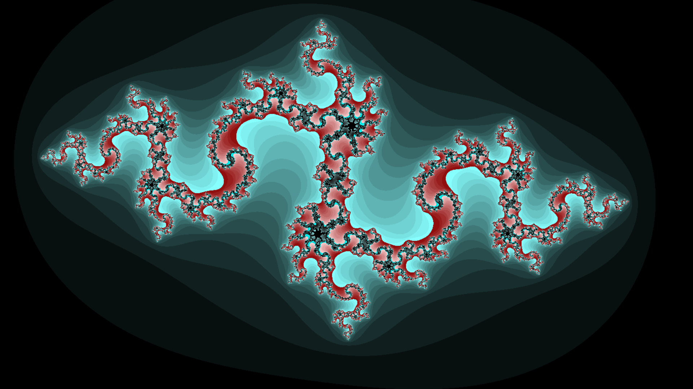
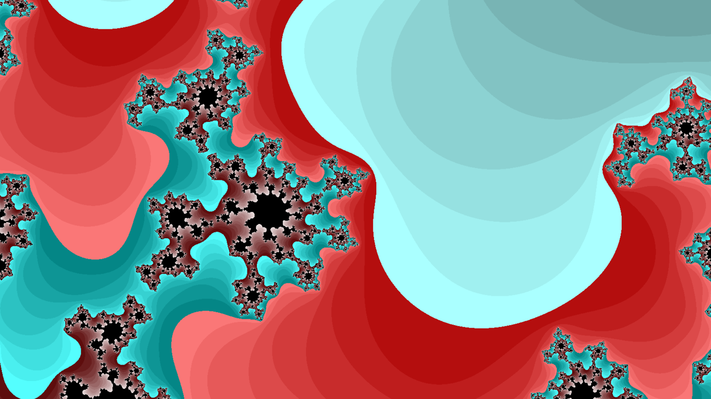

# BSc-mandelbrot-x86

## About 

`10 year lookback on my first B.Sc. programming project`

This was my first university project during my B.Sc. studies -- [UBB Computer Science](https://www.cs.ubbcluj.ro/en/), first year, first semester, `x86 assembly`.
The Christmas holiday project task was to implement the Mandelbrot set in x86 assembly language, preferably with vectorized register commands.
Still remember coding literally under the tree, and cheering for my first bigger project compiling, and eventually, running.

Just wanted for me to remember this code, forever. Right now, late January, is roughly the 10-year anniversary of my first exam session, when I presented this code.
Keeping this as a small time capsule, to remember where I started.

> Note: The original project relied on Windows‑only libs provided by the course. So I vibe-coded the necessary C and shim files. Thanks, Gemini and ChatGPT -- the AI era helped revive this.

## Build (native)

Requirements:
- `nasm`
- `gcc` with multilib (`gcc-multilib`, `libc6-dev-i386`)
- `pkg-config`
- `libsdl2` (32-bit)

Build:
```
./build.sh
```

Run:
```
./bin/mandelbrot
```

## Quick run with Docker

* just run: `docker-run.sh`
* or use the pre-built image published on [Docker Hub](https://hub.docker.com/repository/docker/attilamester/mandelbrot-x86/general):
```
docker run --rm -it \
    -e DISPLAY="unix${DISPLAY:-:0}" \
    -v /tmp/.X11-unix:/tmp/.X11-unix \
    attilamester/mandelbrot-x86:latest
```

## Build with Docker

```
docker compose build mandelbrot
docker compose run mandelbrot
```

If the window does not appear, allow local X11 access on the host:
```
xhost +local:root
```

## Controls

- `W/A/S/D` — move
- Mouse drag — pan
- Mouse wheel — zoom in/out
- `r` — reset
- `ESC` or close window — quit

## Notes

- Precision adapts while moving/zooming for responsiveness.
- Very deep zoom will eventually lose detail due to single-precision floats.

## Demo


### Screenshots






